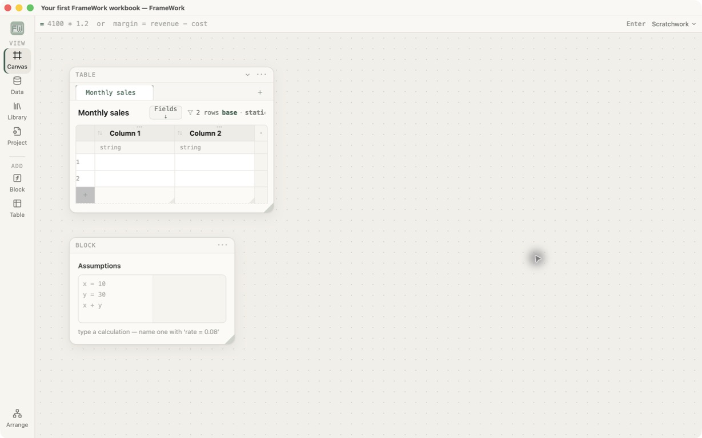
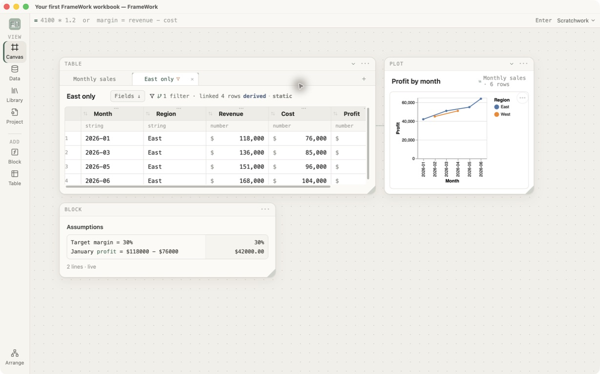

# Your first FrameWork workbook

This is the starting point. It begins with an empty 2×2 table and ends with a
small monthly-sales model. You will paste data, calculate profit once for the
whole column, declare its order, make an independently filtered tab, write two
block calculations, add a live markdown narrative, and make a plot.

## Files

- [`first-workbook-start.fw`](first-workbook-start.fw) — empty table and block.
- [`first-workbook-finished.fw`](first-workbook-finished.fw) — answer key.

These captures were taken after reopening both generated files in the current
Tauri build:





## Before you begin

This lesson takes about 15 minutes and assumes no prior FrameWork experience.
In the app, open **Data Library**, choose **Create tutorials** if the tutorial
workbooks are not present, and open the finished answer key before the starting
workbook. Make all changes in the starting workbook.

Work through the sections in order. In particular, the Profit column must exist
before the narrative and plot can refer to it. Stop when a checkpoint differs;
continuing usually makes the first mismatch harder to find.

## 0. See the destination

Open the finished workbook first. You should see a `Monthly sales` table with a
`Profit` column, an `East only` tab, an `Assumptions` block, and a line plot.
Then open the starting workbook.

## 1. Paste the table

Select the first cell of the empty `Monthly sales` table and paste this whole
tab-separated block:

```text
Month	Region	Revenue	Cost
2026-04	West	142000	91000
2026-01	East	118000	76000
2026-06	East	168000	104000
2026-03	East	136000	85000
2026-02	West	124000	79000
2026-05	East	151000	96000
```

Checkpoint: the table becomes four typed columns and six rows. Revenue and Cost
should behave as numbers rather than text.

**Excel translation:** this is the equivalent of pasting a range and converting
it to an Excel Table. In FrameWork, the table is already the primary object.

## 2. Calculate profit once

Right-click the `Cost` header and choose **Add calculated column**. Name it
`Profit` and enter:

```text
`Revenue` - `Cost`
```

Commit the formula. It belongs to the column, so there is nothing to fill down.

Checkpoint: the visible Profit values in chronological order will eventually
be `42000`, `45000`, `51000`, `51000`, `55000`, and `64000`.

## 3. Format the money columns

Select each of `Revenue`, `Cost`, and `Profit`. In **Selection**, use the column
format controls to choose Accounting, USD, zero decimal places, parentheses for
negatives, and a dash for zero.

Checkpoint: changing format does not change the raw values or formulas.

## 4. Declare the order

Click the ascending sort control in the `Month` header.

Checkpoint: rows run from `2026-01` through `2026-06`. Open **Wrangle** and
confirm that Sort is visible at the end of the transformation chain. Header
sorting is real lineage, not a private display arrangement.

## 5. Branch an East-only tab

Use the **+** beside the table tabs and choose **Table view**. Rename the new tab
`East only`. In **Wrangle**, add **Filter rows**:

```text
`Region` == "East"
```

Checkpoint: `East only` contains January, March, May, and June. Switching back
to `Monthly sales` still shows all six rows. The filtered tab is a separate
table with a visible chain, so anything derived from it inherits the filter.

## 6. Use a formula block

In `Assumptions`, enter these two lines:

```text
Target margin = 30%
January profit = $118000 - $76000
```

Checkpoint: the results are `30%` and `$42000.00`. Names and number notation are
part of the calculation, rather than labels added afterwards.

## 7. Write a live narrative

Choose **Text** in the left rail. Click the new card and enter:

```markdown
## Monthly sales

Revenue is {{`Monthly sales`.`Revenue`.sum()}} and profit is {{`Monthly sales`.`Profit`.sum()}}.
```

Inside `{{…}}`, formula autocomplete offers the same values, tables, columns,
and functions used elsewhere. Outside the braces, the card remains ordinary
markdown. Press **Command–Enter** or click away to render it.

Drag the card's bottom-right corner to give the paragraph more room. Change a
Revenue or Cost value in `Monthly sales`: the sentence should update with the
table instead of preserving the number it first displayed.

Checkpoint: the rendered card contains one heading and one sentence showing
Revenue `839000` and Profit `308000`. Reopen the editor, type `{{` on a
temporary line, confirm that formula suggestions appear, and remove that line
before rendering again.

## 8. Plot the result

Return to `Monthly sales`. Use the table-tab **+** and choose **Plot**, or
right-click the table and choose **Plot in a new window**. In the plot inspector
choose:

- chart type: Line;
- X: Month;
- Y: Profit;
- Color: Region.

Rename it `Profit by month`.

Checkpoint: the chart contains six points split between East and West. Changing
the source data should update the chart rather than requiring copied values.

## Finish line

Your workbook should now agree with `first-workbook-finished.fw`:

- 6 source rows;
- 5 columns including Profit;
- January first after sorting;
- 4 rows in East only;
- January Profit = `42000`;
- Assumptions results = `30%` and `$42000.00`;
- a markdown narrative whose revenue and profit remain live;
- a Profit-by-month plot.

Before closing, try undo and redo on the filter or plot. If the visible result
does not travel with history, record it as a smoke-test failure.
