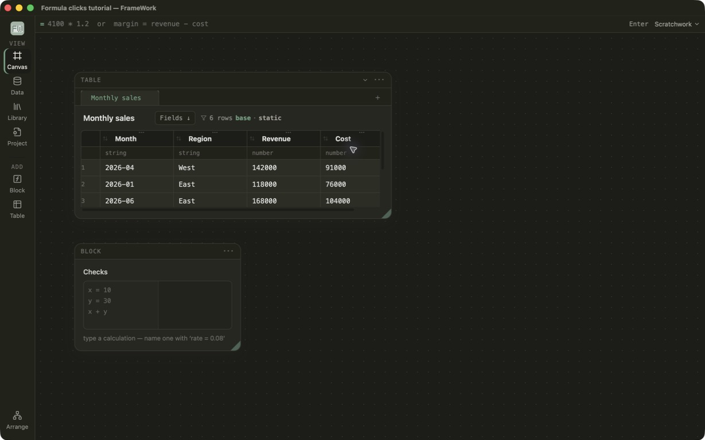
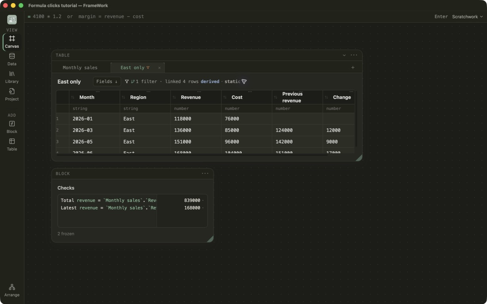

# Month-over-month formulas by pointing

This intermediate tutorial starts with six deliberately unsorted monthly sales rows and ends
with a small model built through the same public operations exposed by FrameWork
MCP. It demonstrates:

- a header sort becoming real Wrangle lineage;
- creating ``.shift(n)`` by pointing at cells;
- selecting a table first in autocomplete, then typing its column;
- clicking columns into an active formula;
- using a new tab for an exploratory filter, with no separate View filter layer;
- table-qualified formulas in a calculation block.

## Files

- [`formula-clicks-start.fw`](formula-clicks-start.fw) — raw table plus an empty
  `Checks` block.
- [`formula-clicks-finished.fw`](formula-clicks-finished.fw) — the answer key.

If this is your first time in FrameWork, complete
[Your first FrameWork workbook](../first-workbook/README.md) first.

These captures were taken from the current Tauri build after reopening both
generated files:





## Before you begin

Allow about 15 minutes. Complete
[Your first FrameWork workbook](../first-workbook/README.md) first if calculated
columns and Wrangle are new to you. In **Data Library**, create the tutorials if
needed, inspect the finished answer key, and then make every change in the
starting workbook. Repository contributors can instead open the linked `.fw`
files with **File → Open**.

The order of this lesson matters: `.shift(1)` is only meaningful after Month is
sorted. Stop at each checkpoint so that an ordering or naming mistake does not
surface later as an unrelated formula error.

## 1. Declare the row order

Open `formula-clicks-start.fw`. The `Monthly sales` rows are intentionally out
of order.

Click the sort control in the **Month** header once. The rows should read
January through June.

Checkpoint: January is the first row, June is the last, and **Sort** is the
final step shown in Wrangle.

This is not a cosmetic view sort. The header writes a trailing **Sort** step in
Wrangle, so formulas and every downstream table receive the declared order.
That declaration is what makes a row-relative formula safe to save.

## 2. Build `shift(1)` by clicking cells

1. Right-click a **Revenue** cell below the first displayed row.
2. Choose **Formula here**.
3. While the formula is active, click the Revenue cell one row above it.

The formula bar should contain:

```text
`Revenue`.shift(1)
```

The row where the gesture began is only an authoring anchor. FrameWork saves a
column declaration, not a coordinate. A cell two rows above would produce
`.shift(2)`; a row below would produce a negative shift.

Rename the calculated column to **Previous revenue** in the named command and
commit with Enter. The expected values are:

| Month | Revenue | Previous revenue |
|---|---:|---:|
| 2026-01 | 118000 | blank |
| 2026-02 | 124000 | 118000 |
| 2026-03 | 136000 | 124000 |
| 2026-04 | 142000 | 136000 |
| 2026-05 | 151000 | 142000 |
| 2026-06 | 168000 | 151000 |

Checkpoint: the first Previous revenue cell is blank and every later row shows
the Revenue from the preceding month.

If the sort is removed before the shift calculation, FrameWork should refuse
the formula with a declared-ordering error instead of silently using whatever
row order happened to arrive from the source.

## 3. Complete through a table namespace

Add another calculated column in Wrangle and call it **Change**.

In its formula:

1. Start typing `Monthly` and choose the **Monthly sales** table suggestion.
   Completion inserts `` `Monthly sales`. `` and leaves the cursor after the
   dot.
2. Type `rev` and choose **Revenue**. Only columns belonging to that table are
   offered.
3. Type ` - `, then click the **Previous revenue** column in the grid.

The completed formula is:

```text
`Monthly sales`.`Revenue` - `Previous revenue`
```

The expected nonblank changes are `6000`, `12000`, `6000`, `9000`, and
`17000`.

Checkpoint: Change is blank for January and contains those five values from
February through June.

This two-stage completion matters on wide tables: choosing the table does not
force anyone to scroll through every `table.column` combination in the
document.

## 4. Make a filtered exploration tab

1. Use the **+** beside the table tabs and choose **Table view**.
2. Rename the new table **East only**.
3. Open **Wrangle**, add **Filter rows**, and use:

   ```text
   `Region` == "East"
   ```

The `East only` tab should show January, March, May, and June. Switch back to
`Monthly sales` to see all six rows.

Checkpoint: `East only` has four rows while `Monthly sales` still has six, and
the filter appears only in the East-only Wrangle chain.

The tabs differ because they are separate tables with separate Wrangle chains,
not because a hidden display filter can disagree with lineage. Anything derived
from `East only` will inherit the East filter.

## 5. Add table checks

In the `Checks` block, enter:

```text
Total revenue = `Monthly sales`.`Revenue`.sum()
Latest revenue = `Monthly sales`.`Revenue`.last()
```

Both answers appear immediately and remain live. Change a Revenue value: the
total updates, and `Latest revenue` updates when the row declared latest by the
Month sort changes. `.last()` here is an ordered query over the current table,
not a captured screen cell.

Expected answers:

- **Total revenue:** `839000`
- **Latest revenue:** `168000`

The finished workbook already contains these lines and is the answer key for
the complete tutorial. It contains no frozen Scratchwork answers.

## Finish line

Your starting workbook should now agree with the finished answer key:

- Month is sorted from January through June;
- Previous revenue is blank once, then follows the declared order;
- Change has five nonblank month-over-month values;
- East only contains four rows without hiding rows in Monthly sales;
- Total revenue is `839000` and Latest revenue is `168000`;
- changing source Revenue updates the dependent columns and Checks block.

Before closing, undo and redo the East-only filter. The row count and visible
Wrangle chain should travel together. Record the step if either one does not.

## Rebuilding the files

The generator deliberately uses `Store::apply(Operation::...)`, the same
validation, history, persistence, and collaboration boundary used by MCP's
`apply_operation` tool:

```bash
cargo run -p framework-core --example generate_formula_click_tutorial
```

It writes both `.fw` files into this directory, reloads them, and plans the
finished table to catch invalid formulas or persistence drift.
