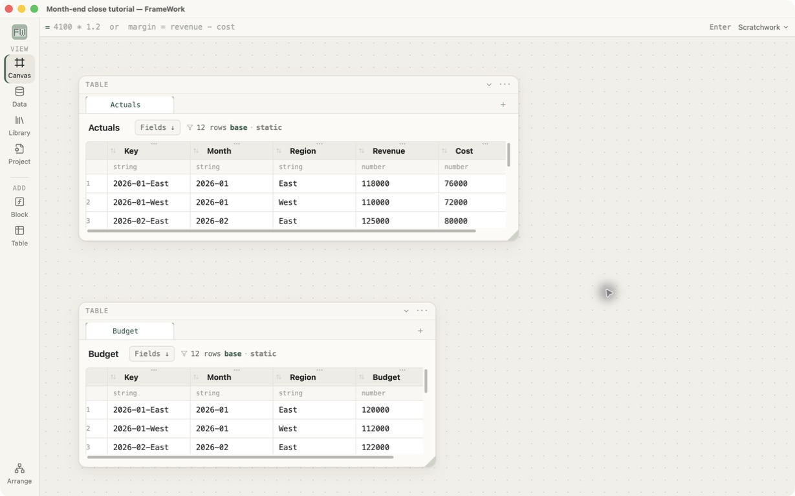
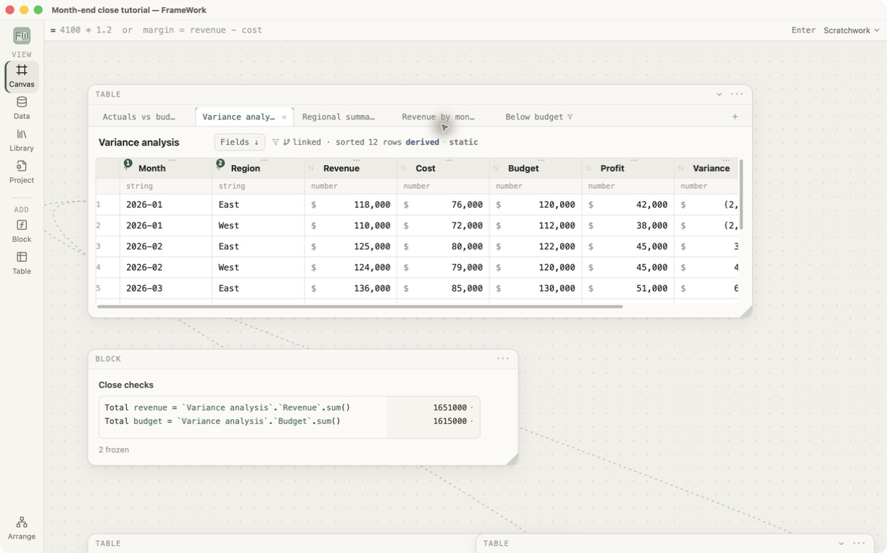

# Month-end close

This advanced project turns separate Actuals and Budget tables into a small
review package. It exercises unique keys, joins, derived analysis tabs,
calculated columns, summaries, pivots, exception filtering, ordering, and live
control totals.

## Files

- [`month-end-close-start.fw`](month-end-close-start.fw) — Actuals, Budget,
  and an empty `Close checks` block.
- [`month-end-close-finished.fw`](month-end-close-finished.fw) — answer key.

These captures were taken after reopening both generated files in the current
Tauri build:





## Before you begin

Allow 30–45 minutes. Complete the first-workbook lesson first; complete the
formula-clicks lesson too if table-qualified formulas are unfamiliar. In
**Data Library**, create the tutorials if needed, inspect the finished answer
key, and then work only in the starting workbook. Repository contributors can
instead open the linked `.fw` files with **File → Open**.

This project builds several results from one joined table, so names and row
counts are dependencies. Stop at every checkpoint. If a later total differs,
return to the first checkpoint that does not agree rather than correcting a
downstream table by hand.

The sample carries a `Key` such as `2026-01-East`. FrameWork currently joins one
column on each side, so this explicit stable key represents Month + Region. If
that feels like avoidable preparation while completing the tutorial, record it:
that is exactly the kind of product feedback this smoke test should expose.

## 0. Inspect the answer key

Open the finished workbook first. Find the analyzed `Actuals vs budget` join
and its branch tabs:

- Regional summary;
- Revenue by month;
- Below budget.

The same tab strip also includes a Revenue-by-region plot so the finished
package demonstrates that a plot can live beside the table it explains.

Then open the starting workbook.

## 1. Join Actuals to Budget

Right-click `Actuals` and choose **Join another table**.

- Starting key: Key
- Lookup table: Budget
- Lookup key: Key
- Keep: every Actuals row
- Result name: Actuals vs budget
- Output columns: Month, Region, Revenue, Cost, and Budget

The join panel should report that Budget's Key appears unique. Click **Mark
unique**, then create the joined table.

Checkpoint: 12 matched, 0 unmatched, 0 duplicates, and 12 result rows. If the
join can be created without protecting the lookup key, that is a correctness
failure.

## 2. Analyze the joined result in place

Select `Actuals vs budget`, open **Wrangle**, and add these calculated columns
directly to the joined result:

```text
Profit = `Revenue` - `Cost`
Variance = `Revenue` - `Budget`
Variance % = (`Revenue` - `Budget`) / `Budget`
```

Format the first two as USD Accounting and Variance % as Percentage with one
decimal place. Sort by Month ascending and Region ascending.

Checkpoint: January East has Profit `42000`, Variance `-2000`, and Variance %
about `-1.7%`.

## 3. Summarize by region

Branch `Actuals vs budget` to a tab named `Regional summary`. Add **Summarize**
in Wrangle:

- Group by: Region
- Total Revenue: `` `Revenue`.sum() ``
- Total Budget: `` `Budget`.sum() ``
- Total Variance: `` `Variance`.sum() ``
- Total Profit: `` `Profit`.sum() ``

Checkpoint:

| Region | Revenue | Budget | Variance | Profit |
|---|---:|---:|---:|---:|
| East | 843000 | 822000 | 21000 | 310000 |
| West | 808000 | 793000 | 15000 | 290000 |

## 4. Pivot revenue across months

Branch `Actuals vs budget` again and name it `Revenue by month`.

1. Add **Rearrange columns** or a Select step that keeps Region, Month, Revenue.
2. Add **Pivot**.
3. Names column: Month.
4. Values column: Revenue.
5. Aggregate: Sum.

Checkpoint: two region rows and six month columns. East runs from `118000` in
January to `168000` in June; West runs from `110000` to `155000`.

## 5. Isolate exceptions

Branch `Actuals vs budget` once more and name it `Below budget`. Keep Month,
Region, Revenue, Budget, and Variance, then add:

```text
`Variance` < 0
```

Checkpoint: exactly two rows remain—January East and January West, each with a
variance of `-2000`.

## 6. Add live close controls

In `Close checks`, enter:

```text
Total revenue = `Actuals vs budget`.`Revenue`.sum()
Total budget = `Actuals vs budget`.`Budget`.sum()
```

Checkpoint: Total revenue is `1651000`, Total budget is `1615000`, and both
answers appear immediately. Change one Revenue or Budget value upstream: its
control total and every calculation that reads that line update without
materializing the analysis table.

## Finish line

The finished package has:

- 12 joined and analyzed rows;
- total favorable variance of `36000`;
- regional totals that reconcile to the full table;
- a 2×6 revenue pivot;
- exactly two below-budget exceptions;
- two live control totals;
- a revenue-by-region plot on the analysis tab strip.

Finally, change one Budget value in the starting workbook and repeat the model
from that point. Every dependent result and both control totals should update.
Record any step that requires guessing where a control lives—the tutorial is
serving its purpose when it finds that friction.

For a final history check, undo and redo that Budget edit. The joined analysis,
summary, pivot, exception table, plot, and Close checks should return to the
same visible states as the source value.
